# Android Security Assessment using Drozer – DIVA Application

## 📌 Overview

This project presents a security assessment of the vulnerable Android application **DIVA (Damn Insecure and Vulnerable App)** using the **Drozer** framework.

The objective of this lab was to:

- Configure a mobile security testing environment
- Connect Drozer with an Android emulator
- Enumerate Android application components
- Identify exported components
- Analyze AndroidManifest.xml
- Detect insecure Content Providers
- Evaluate potential security risks
- Map vulnerabilities to OWASP MASVS controls

---

# 🛠️ Tools Used

| Tool | Purpose |
|---|---|
| Android Emulator | Android testing environment |
| ADB | Communication with emulator |
| Drozer | Android security assessment |
| DIVA APK | Vulnerable Android application |
| macOS Terminal | Command execution |

---

# 🧱 Architecture of the Lab

This architecture shows the communication between the host machine, Android emulator, Drozer Agent, and Drozer Console.

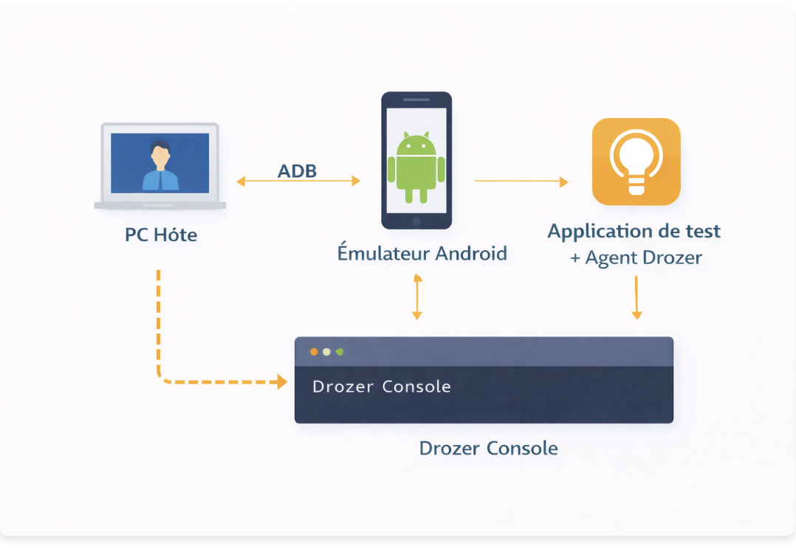

---

# ⚙️ Environment Validation

## ✅ ADB Verification

The following commands were used to verify ADB installation and emulator connectivity.

```bash
adb version
adb devices
```

### Screenshot

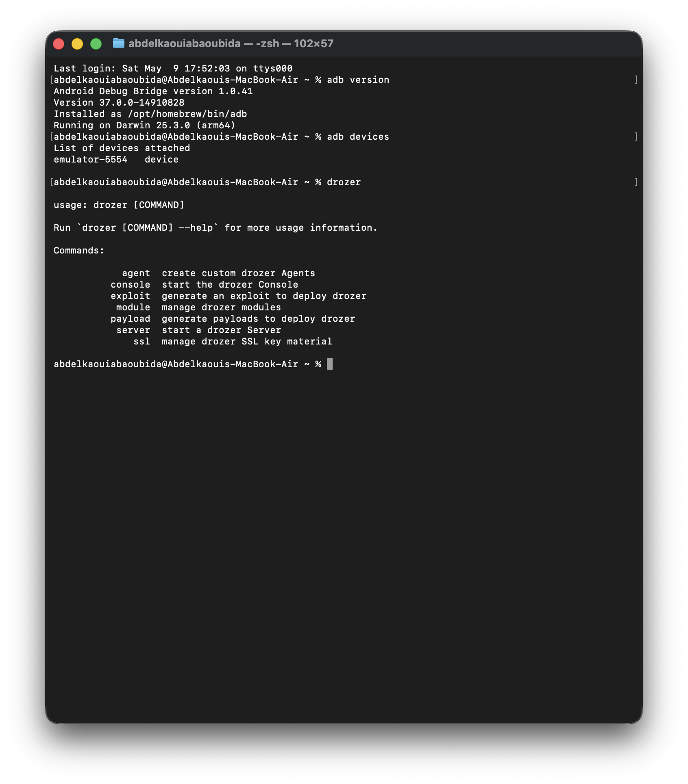

---

# 📱 Drozer Agent Configuration

The Drozer Agent was installed and launched inside the Android emulator.

The embedded server was enabled on port `31415`.

### Screenshot

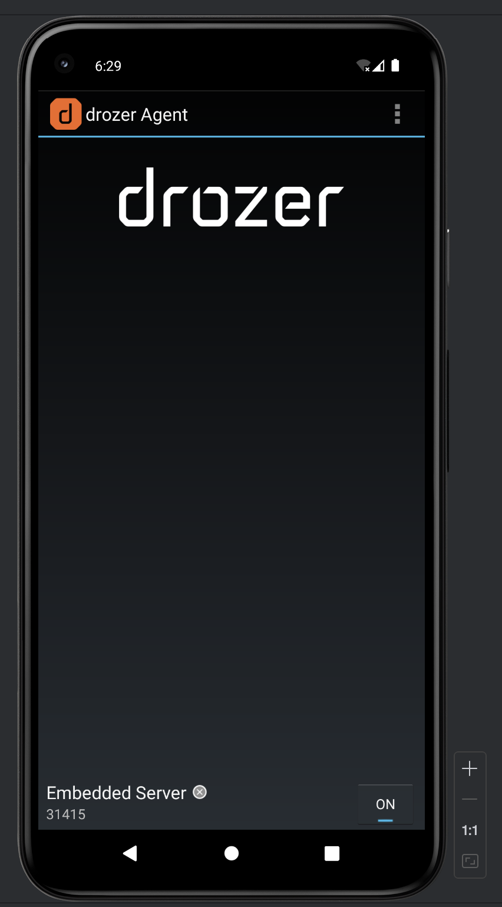

---

# 🔌 ADB Port Forwarding

ADB port forwarding was configured to allow communication between Drozer Console and the Android emulator.

```bash
adb forward tcp:31415 tcp:31415
```

### Screenshot

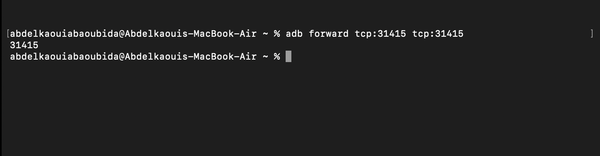

---

# 🖥️ Connection to Drozer Console

The Drozer console was connected successfully to the Android emulator.

The `list` command was used to enumerate available Drozer modules.

### Screenshot

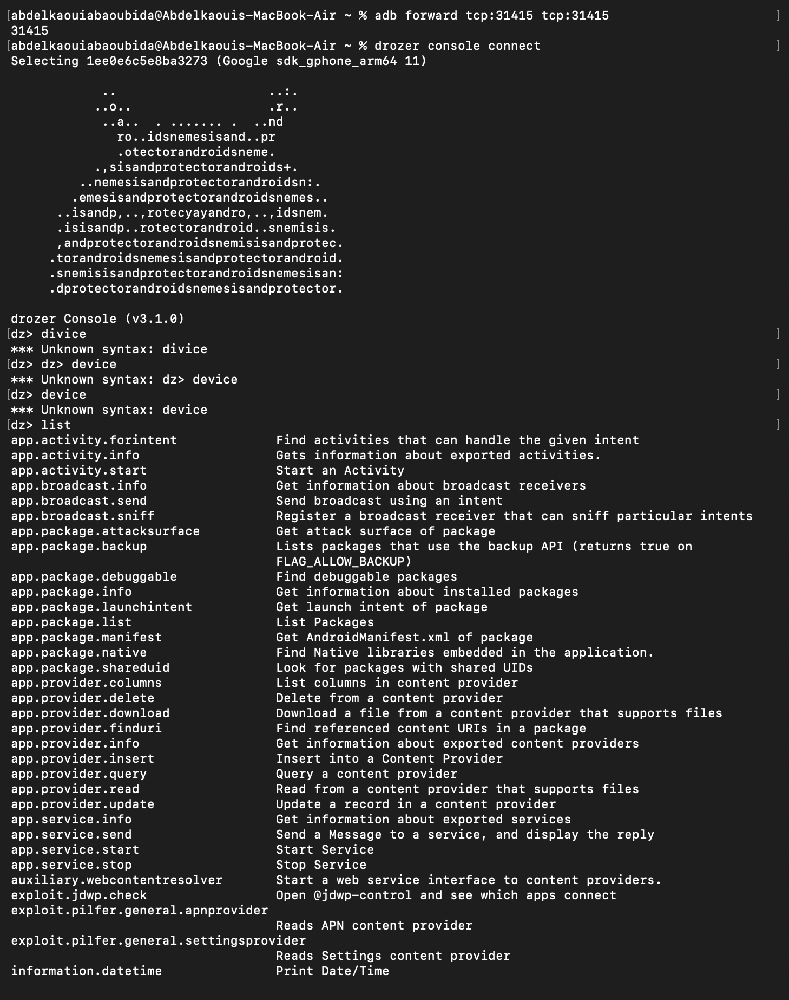

---

# ⚠️ Device Information Attempt

An attempt was made to retrieve device information using Drozer.

The emulator denied access to `/proc/version`, generating a permission error.

### Screenshot

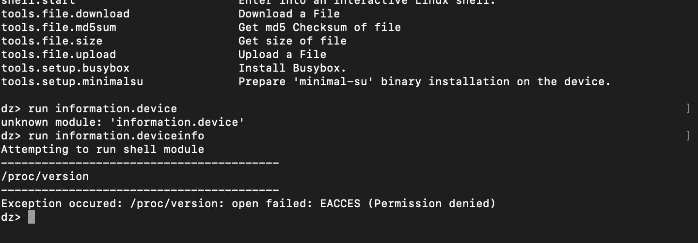

### Observation

This demonstrates Android sandboxing and permission restrictions.

---

# 📦 Package Enumeration

Installed packages were enumerated using:

```bash
run app.package.list
```

The vulnerable application was identified using:

```bash
run app.package.list -f diva
```

### Screenshot

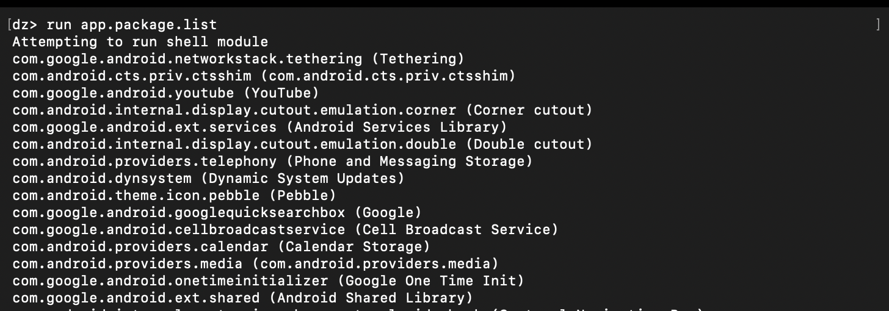

---

# 🔍 Application Information Gathering

Detailed information about the DIVA application was collected.

Command used:

```bash
run app.package.info -a jakhar.aseem.diva
```

The following information was discovered:

- Package name
- Application label
- APK path
- Permissions
- UID/GID
- Shared libraries

### Screenshot

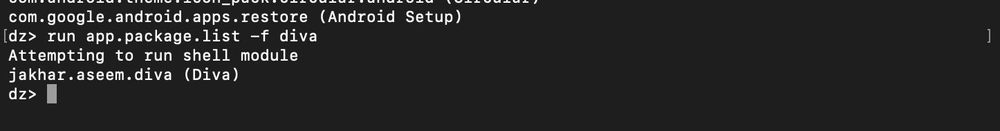

---

# 🧩 Exported Component Enumeration

Drozer was used to identify exported Android components.

## Activities

```bash
run app.activity.info -a jakhar.aseem.diva
```

## Services

```bash
run app.service.info -a jakhar.aseem.diva
```

## Broadcast Receivers

```bash
run app.broadcast.info -a jakhar.aseem.diva
```

## Content Providers

```bash
run app.provider.info -a jakhar.aseem.diva
```

### Findings

### Exported Activities
- `MainActivity`
- `APICredsActivity`
- `APICreds2Activity`

### Exported Provider
- `jakhar.aseem.diva.provider.notesprovider`

### Screenshot

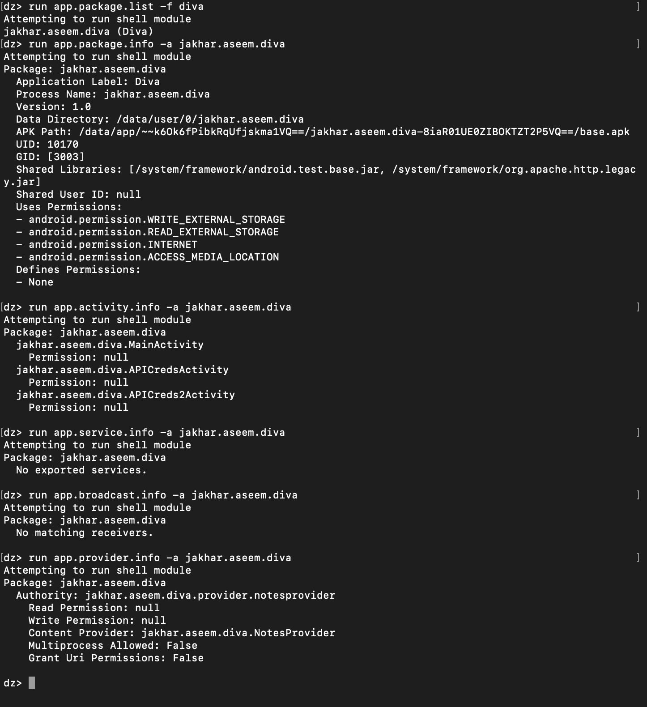

---

# 📜 AndroidManifest Analysis

The AndroidManifest.xml file was extracted and analyzed using:

```bash
run app.package.manifest jakhar.aseem.diva
```

## Important Findings

### Dangerous Configuration Detected

```xml
android:debuggable="true"
android:allowBackup="true"
```

### Exported Provider

```xml
<provider
    android:name="jakhar.aseem.diva.NotesProvider"
    android:exported="true"
    android:authorities="jakhar.aseem.diva.provider.notesprovider">
</provider>
```

### Screenshot

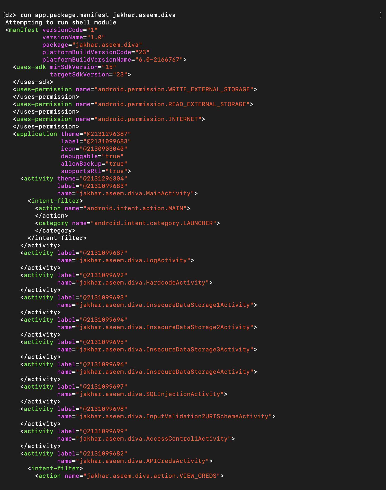

---

# 🎯 Intent Filter Analysis

Intent filters for exported activities were analyzed.

Command used:

```bash
run app.activity.info -a jakhar.aseem.diva -i
```

### Findings

The following custom intents were discovered:

- `jakhar.aseem.diva.action.VIEW_CREDS`
- `jakhar.aseem.diva.action.VIEW_CREDS2`

### Screenshot

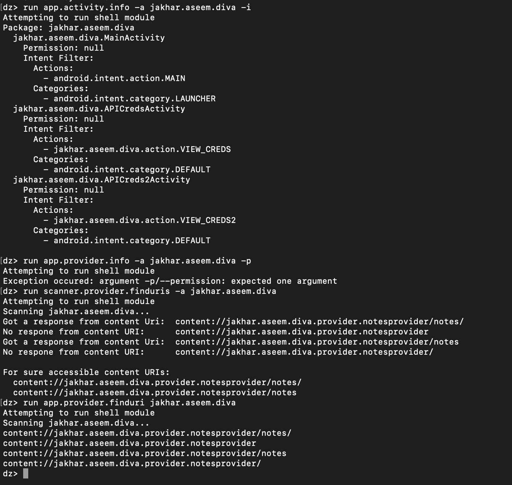

---

# 🔓 Content Provider Accessibility Analysis

Drozer was used to identify accessible content URIs.

## Commands Used

```bash
run scanner.provider.finduris -a jakhar.aseem.diva
```

```bash
run app.provider.finduri jakhar.aseem.diva
```

### Accessible URIs

```text
content://jakhar.aseem.diva.provider.notesprovider/notes/
content://jakhar.aseem.diva.provider.notesprovider/notes
```

### Security Issue

The provider was accessible without authentication or permissions.

### Screenshot

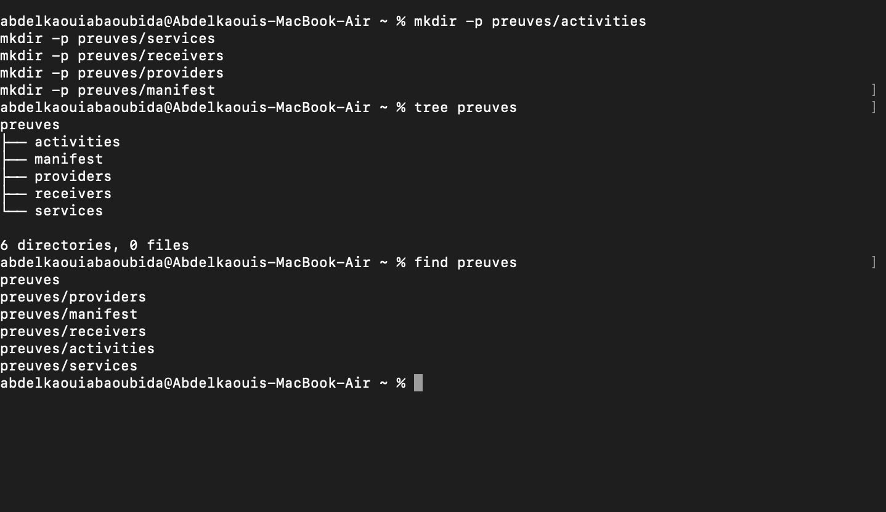

---

# 📁 Evidence Collection

A structured evidence directory was created to organize findings.

## Commands Used

```bash
mkdir -p preuves/activities
mkdir -p preuves/services
mkdir -p preuves/receivers
mkdir -p preuves/providers
mkdir -p preuves/manifest
```

### Screenshot

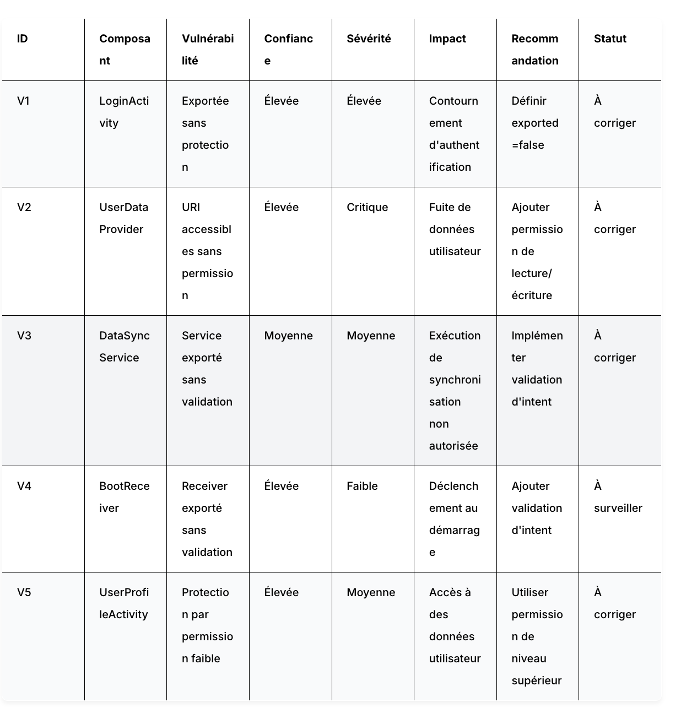

---

# 🚨 Risk Analysis

## Identified Risks

| Component | Risk |
|---|---|
| Exported Activities | Unauthorized access to internal screens |
| Content Provider | Unauthorized data access |
| Debuggable Application | Easier reverse engineering |
| allowBackup Enabled | Data extraction possibility |
| Custom Intents | Intent abuse attacks |

---

# 📊 Vulnerability Triage

The following vulnerability prioritization matrix was created during the lab.

### Screenshot

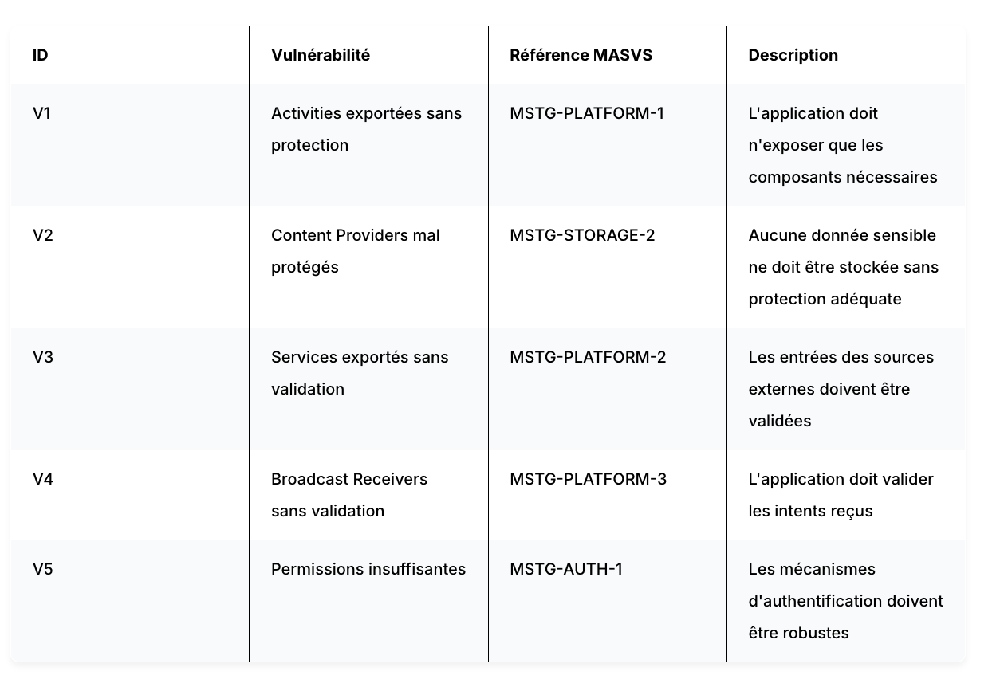

---

# 🛡️ OWASP MASVS Mapping

| Vulnerability | MASVS Reference |
|---|---|
| Exported Activities | MSTG-PLATFORM-1 |
| Insecure Providers | MSTG-STORAGE-2 |
| Weak Permissions | MSTG-AUTH-1 |
| Intent Validation Issues | MSTG-PLATFORM-3 |

---

# 🔧 Remediation Recommendations

## Activities

- Set internal activities to:

```xml
android:exported="false"
```

---

## Content Providers

- Protect providers with custom permissions
- Disable export if unnecessary

Example:

```xml
android:exported="false"
```

---

## Debug Configuration

Disable debugging in production:

```xml
android:debuggable="false"
```

---

## Backup Configuration

Disable backups:

```xml
android:allowBackup="false"
```

---

# ✅ Conclusion

This lab demonstrated how Drozer can be used to perform Android application security assessments.

The DIVA application exposed several insecure configurations including:

- Exported activities
- Accessible content providers
- Weak application protections
- Dangerous debug settings

The assessment highlighted the importance of:
- Proper component protection
- Secure manifest configuration
- Permission enforcement
- Input validation
- Secure application deployment practices

---

# 📚 References

- OWASP MASVS
- OWASP MSTG
- Drozer Documentation
- Android Security Best Practices

---

# 👨‍💻 Author

- **Name:** Abdelkaoui Abaoubida
- **Platform:** EMSI / MLIAEdu
- **Lab:** Android Security Assessment with Drozer
- **Target Application:** DIVA
